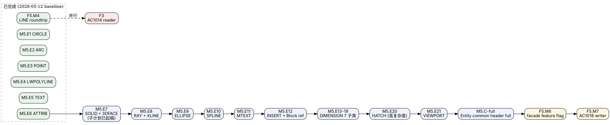

# H7CAD DWG 读写支持 · 2026 Q2 落地计划

> **起稿**：2026-05-12
> **基线快照**：F5.M4 完成（LINE roundtrip）；F5.M5.E1–E6 完成（CIRCLE/ARC/POINT/LWPOLYLINE/TEXT/ATTRIB writer）；F5.M5.E7 子计划（SOLID/3DFACE）已起稿待落地；reader 端 AC1015/AC1018 已稳态
> **范围**：`crates/h7cad-native-dwg/`、`crates/h7cad-native-facade/`、`src/io/mod.rs`、对应测试与文档
> **不在范围**：DXF（已闭环）、PID（独立流水线）、acadrust 移除（F5.M6 完成后另起）
> **父文档**：`docs/plans/2026-05-08-dwg-next-step-plan.md` 的 forward refresh；不替换原文，新增/修正其执行节奏

---

## 0. TL;DR

本计划是 2026-05-08 主路线的 **6 周冲刺版**，把焦点压缩到三条必须并行推进的主线：

1. **F5.M5 写入器扩张**：从 6 类（LINE/CIRCLE/ARC/POINT/LWPOLYLINE/TEXT/ATTRIB）推进到 **覆盖 sample_AC1015.dwg ≥98% 实体**。
2. **F5.M6 facade 切换**：在 M5 主体闭环后，把 `crates/h7cad-native-facade/src/lib.rs` 的 `save(Dwg, _)` 从 placeholder 换成 native writer，但 runtime 默认仍走 acadrust（feature flag 互斥）。
3. **F3 AC1014 reader bring-up**：作为「读取面」的实质推进，目标是把 R14 从 `UnsupportedHeaderLayout` 推到 weak gate。

F4（R2007+ reader）与 F6（长尾 entity 投影）保持「穿插推进」，**不进入本 6 周冲刺的硬目标**，只承诺技术路径不被本计划改动堵死。

---

## 1. 当前事实盘点（2026-05-12）

### 1.1 写入路径

| 维度 | 现状 |
|---|---|
| Runtime `src/io/mod.rs:359` `save_dwg` | 仍走 `acadrust::DwgWriter::write_to_file`，按 `doc.header.version` 选择 AC1015/AC1018/AC1021 输出 |
| facade `save(NativeFormat::Dwg, _)` | 显式 `Err("native DWG writer not implemented yet")`，被测试 `dwg_runtime_save_is_unavailable` 锁定 |
| `h7cad-native-dwg` writer 入口 | `crates/h7cad-native-dwg/src/writer/document.rs:1` 的 `write_dwg` 已能写 AC1015 空文档 + LINE/CIRCLE/ARC/POINT/LWPOLYLINE/TEXT/ATTRIB roundtrip |
| 已具备的 writer 模块 | `bit_writer.rs`、`writer/file_header.rs`、`writer/section_*.rs`（6 个 known section）、`writer/handle_map.rs`、`writer/object_*.rs`、`writer/entity_{line,circle,arc,point,lwpolyline,text,attrib}.rs` |
| Common entity header | M4.C minimal：`owner_handle` 恒为 `Handle::NULL`、`lineweight` 恒为 `-3`（ByDefault）—— 须在 M5 末尾以 `write_ac1015_entity_common_full` 收尾 |

### 1.2 读取路径

| 版本 | 状态 |
|---|---|
| AC1012 (R13) / AC1014 (R14) | sniff OK，`DwgFileHeader::parse` 仍 `UnsupportedHeaderLayout` |
| **AC1015 (R2000)** | ✅ 完整流水线，sample_AC1015.dwg 实测 238 entities（包含 82 LINE / 9 CIRCLE / 3 ARC / 34 POINT / 26 TEXT / ≥17 LWPOLYLINE / 6 HATCH 等） |
| **AC1018 (R2004)** | ✅ R46-A→E2 流水线 + per-family ratchet（sample 实测 11 entities / 2 blocks / 2 layouts / 281 objects） |
| AC1021 (R2007) | 仍 fail-closed（string stream 分离 + page header 加密增强未实现） |
| AC1024 / AC1027 / AC1032 | 仍 fail-closed |
| Entity body decoder 覆盖 | ~22 类，文件 `crates/h7cad-native-dwg/src/entity_*.rs`，由 `crates/h7cad-native-dwg/src/lib.rs:286` 的 `try_decode_entity_body` 分发 |

### 1.3 文档与对外承诺

- `README.md` 的「Native DWG Parser Status」段已校准（AC1015/AC1018 native 可读；写仍走 acadrust）。
- `docs/plans/` 目录已有 21+ 份相关子计划（最新：`2026-05-12-dwg-m5e7-solid-face3d-plan.md`）。

---

## 2. 6 周冲刺目标

### 2.1 主目标（必达）

| 编号 | 目标 | 验收 |
|---|---|---|
| G1 | F5.M5 全量 entity body writer 收口 | `write_dwg(sample_AC1015.dwg 等价文档) → read_dwg` 的 entity-family count 全部守恒（误差 ≤ 1） |
| G2 | M5.C-full entity common header writer 上线 | `owner_handle` 与 `lineweight` 不再走 minimal placeholder；reader 测试断言可读出 caller 传入值 |
| G3 | F5.M6 facade 切换（feature flag） | `h7cad-native-facade::save(Dwg, _)` 在 `--features native_dwg_writer` 下返回 native 结果；默认 build 行为不变 |
| G4 | F5.M7 AC1018 写入扩张（M5 主体之后） | sample_AC1018.dwg 经 `read → write → read` round-trip family-count 守恒 |

### 2.2 副目标（尽力达）

| 编号 | 目标 | 验收 |
|---|---|---|
| S1 | F3 AC1014 reader weak gate | `read_dwg(sample_AC1014_bytes)` 返回 `Ok(doc)` 且 `entities >= 1` |
| S2 | F6.M0 ProxyEntity preserve-only | `EntityData::ProxyEntity { raw_bytes }` variant 落地，reader 不解析仅保留原 bytes，避免遇到未知 class 直接静默丢实体 |

### 2.3 非目标（本冲刺不做）

- F4 R2007+ reader（acadrust fallback 已能兜底）
- F6.M1-M4 Helix/Surface/Light/Camera/Section 长尾实体（独立 PR 队列）
- acadrust 移除（独立 milestone，依赖 G3 完成才能启动）
- DWG 加密文件密码解密

---

## 3. 子里程碑切分



### 3.1 F5.M5 entity writer 队列（按价值×难度排序）

| 子里程碑 | entity | object_type | 复杂度 | sample 频次 | 预估 |
|---|---|---|---|---|---|
| **M5.E7** | SOLID + 3DFACE | 31 / 28 | ★ | 低 | 1.5–2.5h（子计划已起稿）|
| **M5.E8** | RAY + XLINE | 38 / 40 | ★ | 极低 | 1h |
| **M5.E9** | ELLIPSE | 35 | ★★ | 低 | 2h |
| **M5.E10** | SPLINE | 36 | ★★★★ | 低 | 5–8h |
| **M5.E11** | MTEXT | 44 | ★★★★ | 低 | 5–8h |
| **M5.E12** | INSERT + 可选 attrib 链 | 7 | ★★★★ | 中 | 6–10h |
| **M5.E13..E19** | DIMENSION 7 子类 | 21..26 + 20 | ★★★★★ | 0–低 | 1–2 天/类（共 7 PR） |
| **M5.E20** | HATCH | 78 | ★★★★★ | **6（sample 中第二高频复杂体）** | 独立子计划文件，2–3 天 |
| **M5.E21** | VIEWPORT | 34 | ★★★★ | 6 | 4–6h |

关键依赖：`crates/h7cad-native-dwg/src/writer/document.rs:1` 的 `encode_entity` dispatch 是每个 Ex 共同入口，已是稳定模式，每个 Ex 改动 ≤ 6 个文件。

### 3.2 M5.C-full 收口

触发条件：M5.E20 HATCH 落地后立即开工。

范围：把 `crates/h7cad-native-dwg/src/writer/entity_common.rs:1` 的 `write_ac1015_entity_common_minimal` 升级到 full：

- 写入真实 `owner_handle`（来自 caller 传入的 `Handle`）。
- 写入真实 `lineweight`（DWG lineweight index，与 `crates/h7cad-native-dwg/src/lib.rs` 的 `dwg_lineweight_from_index` 对偶）。
- 写入 `layer / linetype / linetype_scale / color_index / invisible / thickness / extrusion`，与 reader 端 `parse_ac1015_entity_common` 字段顺序严格镜像。
- 所有 M5.Ex 单测从「不验证 owner/lineweight」升级到「断言读回值 == 写入值」。

### 3.3 F5.M6 facade & runtime 切换（最敏感节点）

按 `docs/plans/2026-05-08-dwg-next-step-plan.md` §7.6 的 fallback 原则：

1. **新增 feature flag**：`h7cad-native-facade` 与主 bin 各自加 `[features] native_dwg_writer = []`。
2. **facade 实现**：在 `crates/h7cad-native-facade/src/lib.rs` 中：
   - `#[cfg(feature = "native_dwg_writer")]` 时 `save(Dwg, doc)` 调 `h7cad_native_dwg::write_dwg(doc).map_err(...)`。
   - 默认 build 行为不变（继续返回 placeholder Err）。
3. **runtime `save_dwg`**：在 `src/io/mod.rs:359` 加 `#[cfg(feature = "native_dwg_writer")]` 分支，优先 native writer；失败时降级到 `acadrust::DwgWriter::write_to_file` 并通过 `OpenNotice::Warning` 通知。
4. **测试**：把 `dwg_runtime_save_is_unavailable` 锁拆成 default-build 仍锁 placeholder、feature-build 锁 roundtrip-equivalent。
5. **CHANGELOG / README**：明确「feature flag 默认 off；启用后 native writer + acadrust 降级保底」。

### 3.4 F5.M7 AC1018 writer

复用 reader 端 `crates/h7cad-native-dwg/src/lib.rs:172` 的 `read_dwg_ac1018` 反向：

1. `bridged` AC1015 well-known sections → 经 `writer/document.rs` 产出 AC1015 风格 payload。
2. 反向 `read_ac1018_section_payload`：把 plaintext payload 切页 → 加 CRC → LZ77 压缩 → XOR 加密。
3. 反向 `parse_ac1018_section_map`：合成 section descriptor map → page map → encrypted metadata。
4. roundtrip 验收：`sample_AC1018.dwg → read_dwg → write_dwg → read_dwg → 等价`。

### 3.5 F3 AC1014 reader weak gate（并行支线）

范围 `crates/h7cad-native-dwg/src/file_header.rs:1`：

- 加 R14 分支：`section_count_offset(Ac1014)`、`locator_record_size(Ac1014)` 等查询点。
- 复用 `SectionMap::parse` 与下游 `build_pending_document → resolve_document → enrich_with_real_entities`。
- 测试：`tests/real_samples.rs` 加 AC1014 弱基线 `entities >= 1`；不在仓库可达时 soft-skip。

---

## 4. 任务模板（每个 entity Ex PR 通用）

继承 `docs/plans/2026-05-09-dwg-m5-entity-body-writers-plan.md` §3 的模板，**不得偏离**以下文件改动清单：

| 序 | 文件 | 改动 |
|---|---|---|
| 1 | `crates/h7cad-native-dwg/src/writer/entity_<kind>.rs` | 新建：`pub fn write_<kind>_geometry(geom: <Kind>Geometry, writer: &mut BitWriter) -> Result<(), DwgWriteError>` |
| 2 | `crates/h7cad-native-dwg/src/writer/mod.rs` | `pub mod entity_<kind>; pub use entity_<kind>::write_<kind>_geometry;` |
| 3 | `crates/h7cad-native-dwg/src/lib.rs` | `pub use writer::write_<kind>_geometry;` |
| 4 | `crates/h7cad-native-dwg/src/writer/document.rs` | `encode_entity` 加 `EntityData::<Kind> {...} => encode_<kind>_entity(...)` |
| 5 | `crates/h7cad-native-dwg/tests/roundtrip_minimal.rs` | 加 `write_dwg_with_<kind>_entity_round_trips_through_read_dwg` |

**单 PR 5 步硬约束**（红线，不可压缩）：

1. mirror reader 字段时序 → 写 `write_<kind>_geometry`
2. 3–5 个 `#[cfg(test)] mod tests` writer-internal roundtrip 单测
3. `encode_entity` dispatch + helper
4. `tests/roundtrip_minimal.rs` 集成测试
5. `cargo test -p h7cad-native-dwg --all-targets` 全绿 + `RUSTFLAGS=-Dwarnings cargo check --workspace --all-targets` 零新增

---

## 5. 验收门 (Definition of Done)

| 项 | 要求 |
|---|---|
| 测试 | 每个 Ex 的 roundtrip 测试加入 `roundtrip_minimal.rs`；AC1015 / AC1018 reader baseline_m3b 永不动 |
| 文档 | 每个 Ex 完成后同步：`README.md` Native DWG 段、`docs/DEVELOPMENT-PLAN.md` P2.4、`CHANGELOG.md` |
| 错误诚实 | facade 在 G3（M6）之前**保持** `Err("native DWG writer not implemented yet")` 默认行为；不允许提前替换为「实验性」中间产物 |
| 兼容性 | 任何提交都不允许使 acadrust fallback 路径在错误信息上消失：`OpenNotice` 必须仍能区分「native 走通 / fallback 兜底 / 都失败」三态 |
| Lint | 新增文件 `cargo clippy -- -Dwarnings` 零错误；workspace `-Dwarnings` 零新增 |
| 提交粒度 | 一个 PR 只解决一个 Ex（或一个 DIMENSION 子类）；HATCH 单独 PR；M6/M7 各自独立 PR |
| 性能 | `sample_AC1015.dwg` 整文档 `write_dwg + read_dwg` 在 5 秒内（参考 reader baseline 单 pass < 1 秒）|

---

## 6. 风险与退路

| 风险 | 触发概率 | 退路 |
|---|---|---|
| HATCH boundary path 嵌套结构在 writer 端难以平铺，PR 卡死 | 中 | 把 M5.E20 拆为 E20a（无 boundary path）+ E20b（含 boundary path），先打通 family-count 守恒，后续逐步补字段 |
| `write_ac1015_entity_common_full` 的 owner_handle 写入触发 reader 端旧测试失败 | 中 | M5.C-full 单独一个 PR，先把所有 Ex 测试从 minimal 升级为 full，再合 main |
| facade feature flag 在 M6 切换后，runtime CI 因 cross-feature 漏测出现退化 | 中 | CI 同时跑 `cargo test --workspace` 与 `cargo test --workspace --features native_dwg_writer` 两路 |
| AC1018 writer LZ77 编码与官方 R2004 不完全对等，AutoCAD 读不回 | 高 | M7 不承诺 AutoCAD/BricsCAD 真机读回；只承诺 H7CAD reader 自洽 roundtrip。AutoCAD 兼容性放到独立后续里程碑 |
| F3 R14 header 偏移与 ACadSharp 文档不一致 | 中 | 先实现 `SectionMap::parse_ac1014`，等稳定后再考虑融合 `parse` 主路径 |
| 并行的 reader/writer 工作触发 entity_*.rs 共享类型 churn | 低 | reader 端结构体如 `LineGeometry` 在 v0.1 之内冻结字段；新增字段走 `#[non_exhaustive]` 或 `LineGeometryV2` |

---

## 7. 立即可执行的基线命令

```powershell
# 1. 当前 reader baseline 复核
cargo test -p h7cad-native-dwg --test real_samples real_dwg_samples_baseline_m3b -- --nocapture

# 2. 当前 writer roundtrip baseline
cargo test -p h7cad-native-dwg --test roundtrip_minimal -- --nocapture

# 3. 全量 workspace 基线
cargo test --locked --workspace --all-targets

# 4. lint 基线
$env:RUSTFLAGS='-Dwarnings'; cargo check --locked --workspace --all-targets; Remove-Item Env:RUSTFLAGS
```

---

## 8. 与既有计划的衔接

| 既有计划 | 关系 |
|---|---|
| `docs/plans/2026-05-08-dwg-next-step-plan.md` | **父计划**；本冲刺是其 F5.M5 → F5.M7 的执行精化版 |
| `docs/plans/2026-05-09-dwg-m5-entity-body-writers-plan.md` | **直接父级**；本计划接纳其 §3 任务模板与 §2 优先级队列 |
| `docs/plans/2026-05-12-dwg-m5e7-solid-face3d-plan.md` | 本计划 M5.E7 的具体子计划，已起稿 |
| `docs/plans/2026-04-17-acadrust-removal-plan.md` | 依赖本计划 G3 完成后才能正式启动 |
| `docs/plans/2026-04-21-dwg-save-version-honesty-plan.md` | 已落地，本计划继承 version 桥接结果 |

---

## 9. 节奏与里程碑表

| 周次 | 主线交付 | 并行支线 |
|---|---|---|
| W1 | M5.E7 SOLID/3DFACE + M5.E8 RAY/XLINE | F3 调研：ACadSharp R14 header diff |
| W2 | M5.E9 ELLIPSE + M5.E10 SPLINE | F3.T2 R14 header 实现 |
| W3 | M5.E11 MTEXT + M5.E12 INSERT | F3.T3-T6 R14 弱基线 + ProxyEntity preserve-only |
| W4 | M5.E13–E19 DIMENSION 7 子类（每天 1 类） | — |
| W5 | M5.E20 HATCH（独立子计划文件） | — |
| W6 | M5.E21 VIEWPORT + M5.C-full common header + F5.M6 facade feature flag | F5.M7 AC1018 writer 起稿 |

冲刺末态：`sample_AC1015.dwg` 经 `read_dwg → CadDocument → write_dwg → read_dwg` family-count 全部守恒；facade `--features native_dwg_writer` 可用；AC1014 弱基线落地。

---

*起草者：H7CAD agent；起稿日期 2026-05-12。请在 plannotator 中批注：(a) 优先级是否需要调整（例如把 HATCH 提前），(b) 6 周时间盒是否合理，(c) F3/F4/F6 是否真的应推迟，(d) facade feature flag 命名是否合适。*
